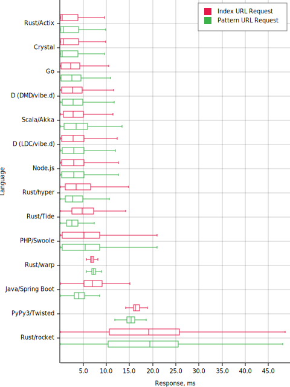

# Simple Web Benchmark

A simple web benchmark of Crystal, D, Go, Java, Node.js, PHP, Python, Rust and Scala.

## Results

## Testing

The stats gathered by the [hey](https://github.com/rakyll/hey) tool (please run it twice for
the JIT optimizations where it's applicable):

    hey -n 50000 -c 256 -t 10 "http://127.0.0.1:3000/"
    hey -n 50000 -c 256 -t 10 "http://127.0.0.1:3000/greeting/hello"

### Using Docker

Build the image:

    $ docker build suite/ -t simple-web-benchmark

Enter the shell in the image:

    $ docker run -it --rm -v $(pwd):/src --network="host" simple-web-benchmark

### Automation

Please use the Rust program to run all tests automatically:

    USAGE:
        cargo run --manifest-path suite/Cargo.toml -- [FLAGS] [OPTIONS] <lang>...

    FLAGS:
        -h, --help       Prints help information
        -V, --version    Prints version information
            --verbose    Enables the verbose output

    OPTIONS:
        -o, --out <file>    Sets an image file to generate (result.svg by default, PNG/SVG/TSV are supported)

    ARGS:
        <lang>...    Sets the languages to test ('all' for all)

    The following languages are supported: go, rust_hyper, rust_rocket, python, scala, dmd, java, nodejs, ldc2, crystal, php.

And another program to get the versions of the languages:

    $ cargo run --manifest-path suite/Cargo.toml --bin versions

## Usage

### Go

    go run go/main.go

### Crystal

Using [Crystal](https://crystal-lang.org/reference/installation/):

    crystal run --release --no-debug crystal/server.cr

### Rust

Please install [Nightly Rust](https://github.com/rust-lang/rustup.rs#working-with-nightly-rust).

Sample applications use [hyper](https://hyper.rs) HTTP library and [Rocket](https://rocket.rs/) web framework:

    cargo run --manifest-path rust/hyper/Cargo.toml --release
    cargo run --manifest-path rust/rocket/Cargo.toml --release

### D

Two compilers are tested:

 - DMD (a reference D compiler);
 - [LDC](https://github.com/ldc-developers/ldc#installation) (LLVM-based D compiler).
If ldc2 executable is not in path, please use the fully qualified path name.

Uses [vibe.d](https://vibed.org/) framework:

    dub run --root=d --compiler=dmd --build=release --config=dmd
    dub run --root=d --compiler=ldc2 --build=release --config=ldc

### Scala

Uses [Akka](https://akka.io/) toolkit:

    make -C scala clean run

### Node.js

    node nodejs/main.js

### PHP

Uses standalone web server and [Swoole](https://www.swoole.co.uk/) extension:

    php -S 127.0.0.1:3000 php/bare/main.php
    php -c php/swoole/php.ini php/swoole/main.php

### Python

Uses standalone web server and [Twisted](https://twistedmatrix.com/trac/) engine:

    python3 python/main.py
    pypy3 python/twist.py

Please note that CPython has the performance problems running as a standalone server, so we've used PyPy3. To install Twisted please use the pip module:

    pypy3 -m ensurepip
    pypy3 -m pip install twisted

### Java

Uses [Sprint Boot](https://spring.io/projects/spring-boot) project:

    make -C java clean run

# Environment

CPU: 2.6 GHz Intel Core i7, Mem: 8 GB 1333 MHz DDR3

Base Docker image: Debian GNU/Linux bullseye/sid

| Language     | Version                         |
| ------------ | ------------------------------- |
| Crystal      | 0.32.1                          |
| DMD          | v2.089.1                        |
| Go           | go1.13.5                        |
| Java         | 13.0.1                          |
| LDC          | 1.18.0                          |
| Node.js      | v13.5.0                         |
| PHP          | 7.3.12-1                        |
| PyPy         | 7.2.0-final0 for Python 3.6.9   |
| Rust         | 1.42.0-nightly                  |
| Scala        | 2.13.1                          |
